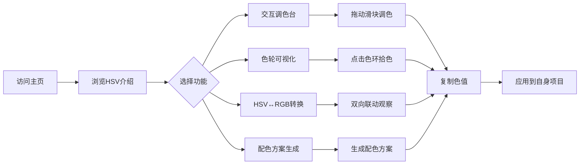

## 1. 产品概述

HSV 色彩探索器是一个交互式可视化教学与配色工具网页,以 HSV(色相 Hue、饱和度 Saturation、明度 Value)色彩模型为核心,通过沉浸式色彩呈现、实时滑块调控、色轮可视化、HSV 与 RGB 互相转换等方式,帮助设计师、图像处理爱好者及学习者直观理解并玩转 HSV 色彩空间。

- 解决问题:HSV 抽象难懂、传统配色工具缺乏直观可视化、RGB↔HSV 转换关系不直观
- 目标用户:图像处理开发者、UI/UX 设计师、色彩学习爱好者、教育工作者
- 市场价值:作为色彩教学、配色灵感、HSV 调试的轻量级在线工具

## 2. 核心功能

### 2.1 用户角色

无需登录,所有访客均可使用全部功能。

### 2.2 功能模块

1. **主页(Landing)**:沉浸式 Hero 色相循环动画、HSV 模型介绍、快速进入交互区
2. **交互调色台(Playground)**:H/S/V 三轴滑块、实时预览、色值显示(HEX/RGB/HSL)、调色历史
3. **色轮可视化(Color Wheel)**:环形色相轮 + 中心明度/饱和度方块,可点击拾色
4. **HSV ↔ RGB 转换**:双向实时转换演示,可视化呈现映射关系
5. **配色方案生成器**:基于当前 HSV 生成互补色、三角、类比、分裂互补等方案

### 2.3 页面详情

| 页面名称 | 模块名称 | 功能描述 |
|---------|---------|---------|
| 主页 | Hero 区 | 全屏色相循环渐变背景,标题文字与色相同步变化 |
| 主页 | 模型介绍 | H/S/V 三维卡片解释,卡片背景随对应维度动态变化 |
| 主页 | 快速入口 | 三个 CTA 卡片通往各功能区 |
| 交互调色台 | 滑块面板 | H/S/V 三个自定义滑块,拖动即时更新大色块预览 |
| 交互调色台 | 色值显示 | HEX、RGB、HSL、HSV 数值四列卡片,点击复制 |
| 交互调色台 | 调色历史 | 横向滚动色块历史记录(最多 12 个),可点击恢复 |
| 色轮可视化 | 色相环 | Canvas 绘制 360° 色相环,鼠标悬停高亮 |
| 色轮可视化 | SV 方块 | 中心方块横轴饱和度、纵轴明度,可点击拾色 |
| HSV↔RGB 转换 | 双向面板 | 左侧 HSV 三滑块,右侧 RGB 三滑块,任一改动双向联动 |
| HSV↔RGB 转换 | 公式展示 | 实时显示当前转换公式的数值代入过程 |
| 配色方案生成器 | 配色面板 | 主色 + 5 种配色方案(互补/三角/类比/分裂互补/四角) |
| 配色方案生成器 | 应用预览 | 配色方案应用于模拟卡片/按钮 UI 的预览效果 |

## 3. 核心流程

用户进入主页 → 浏览 HSV 模型介绍 → 点击进入交互调色台 → 拖动 H/S/V 滑块调整色彩 → 实时查看色值与历史 → 切换至色轮可视化点击拾色 → 进入 HSV↔RGB 转换理解映射 → 进入配色方案生成器获得灵感 → 复制色值应用到自身项目。

## 4. 用户界面设计

### 4.1 设计风格

- **主色与辅色**:深空黑(#0a0a0f)为背景基底,全光谱色相为动态主色,搭配冷灰(#9ca3af)为辅色
- **按钮风格**:扁平带细描边,悬停时色相微移与发光阴影
- **字体**:标题使用 Fraunces(serif,有衬线显示字体,字符极具表现力),正文使用 Manrope(几何无衬线,清晰现代)
- **布局风格**:桌面优先,单页滚动 + 顶部锚点导航,大量留白衬托色彩
- **图标**:Lucide 图标,统一 1.5px 描边

### 4.2 页面设计概览

| 页面名称 | 模块名称 | UI 元素 |
|---------|---------|---------|
| 主页 | Hero 区 | 全屏色相循环渐变背景,超大 Fraunces 标题,标题文字色跟随色相变化,渐入动画 |
| 主页 | 模型介绍 | 三列卡片,卡片背景按对应维度(H/S/V)实时变化,Hover 时上浮 8px |
| 交互调色台 | 滑块面板 | 自定义滑块,轨道为对应维度的渐变,滑块圆形带白色描边 |
| 交互调色台 | 色值显示 | 四列等宽卡片,等宽字体 JetBrains Mono 显示数值,点击即复制并提示 |
| 色轮可视化 | 色相环 | Canvas 360° 渐变色环,中心镂空显示当前色,外圈刻度 0-360 |
| 配色方案生成器 | 配色面板 | 5 个配色方案横向滚动,每方案 5 色色块 + 文字标签 |

### 4.3 响应式

桌面优先(1280px+),平板(768-1280px)切换为双列布局,移动端(<768px)单列垂直堆叠,所有滑块与色块支持触摸操作。

### 4.4 3D 场景指南

不适用本项目。
