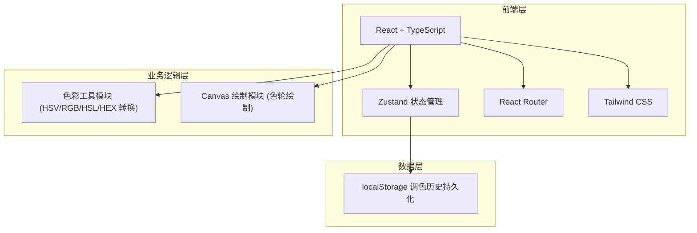
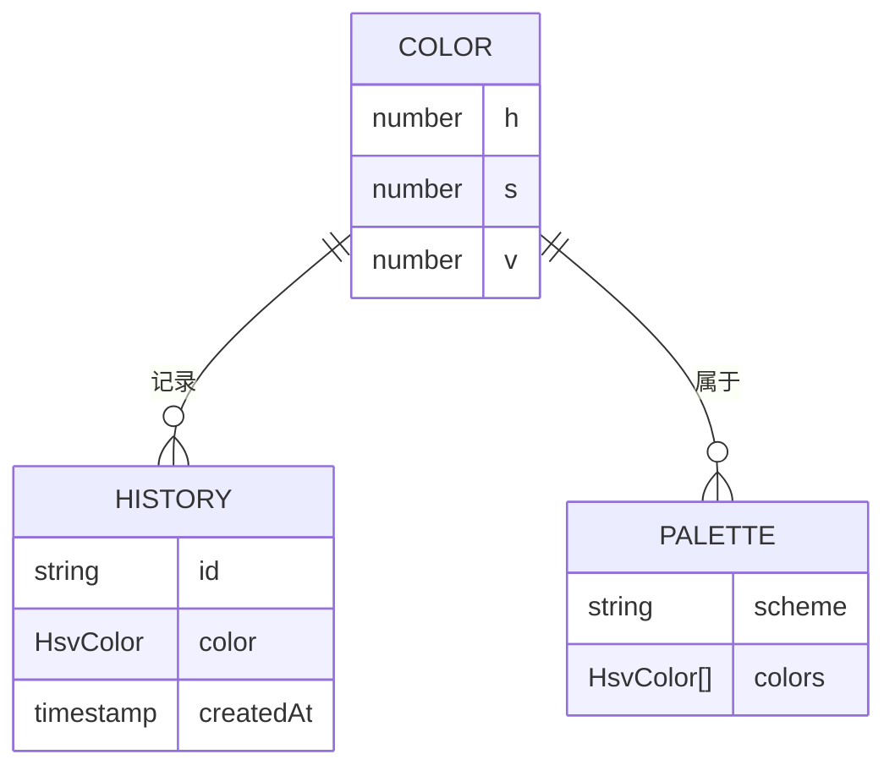

## 1. 架构设计



## 2. 技术说明

- **前端框架**:React@18 + TypeScript + Vite
- **样式方案**:Tailwind CSS@3(自定义色彩 token)
- **状态管理**:Zustand(轻量,适合色彩状态共享)
- **路由**:React Router DOM(锚点滚动 + 多视图)
- **图标**:lucide-react
- **字体**:Google Fonts(Fraunces + Manrope + JetBrains Mono)
- **构建工具**:Vite
- **包管理器**:npm
- **后端**:无(纯前端项目,所有色彩运算在浏览器端完成)
- **数据库**:无(使用 localStorage 存储调色历史)

## 3. 路由定义

| 路由 | 用途 |
|------|------|
| `/` | 主页(Hero + 模型介绍 + 快速入口) |
| `/playground` | 交互调色台 |
| `/color-wheel` | 色轮可视化 |
| `/converter` | HSV ↔ RGB 转换 |
| `/palette` | 配色方案生成器 |

## 4. API 定义

无后端 API。所有色彩转换函数位于 `src/utils/color.ts`:

```typescript
// HSV (0-360, 0-1, 0-1) → RGB (0-255)
export function hsvToRgb(h: number, s: number, v: number): { r: number; g: number; b: number }

// RGB → HSV
export function rgbToHsv(r: number, g: number, b: number): { h: number; s: number; v: number }

// RGB → HEX 字符串
export function rgbToHex(r: number, g: number, b: number): string

// HEX → RGB
export function hexToRgb(hex: string): { r: number; g: number; b: number }

// RGB → HSL
export function rgbToHsl(r: number, g: number, b: number): { h: number; s: number; l: number }

// 生成配色方案(互补、三角、类比、分裂互补、四角)
export function generatePalette(baseHsv: HsvColor, scheme: PaletteScheme): HsvColor[]
```

## 5. 服务器架构图

无后端服务。

## 6. 数据模型

### 6.1 数据模型定义



### 6.2 数据定义语言

无数据库表。localStorage 数据结构:

```typescript
// localStorage key
'hsv-explorer:history' // HistoryItem[] 的 JSON 字符串

interface HistoryItem {
  id: string
  hsv: { h: number; s: number; v: number }
  createdAt: number
}
```
